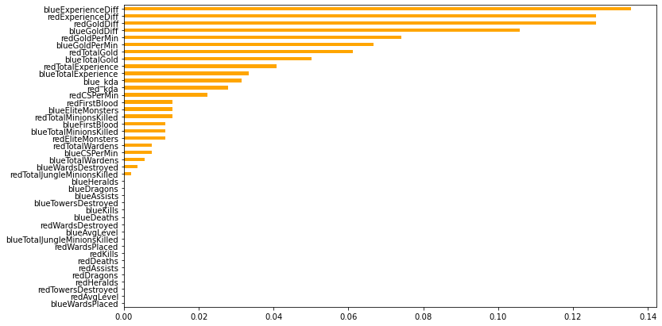
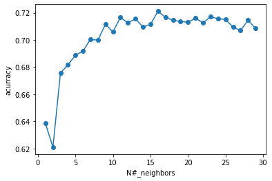
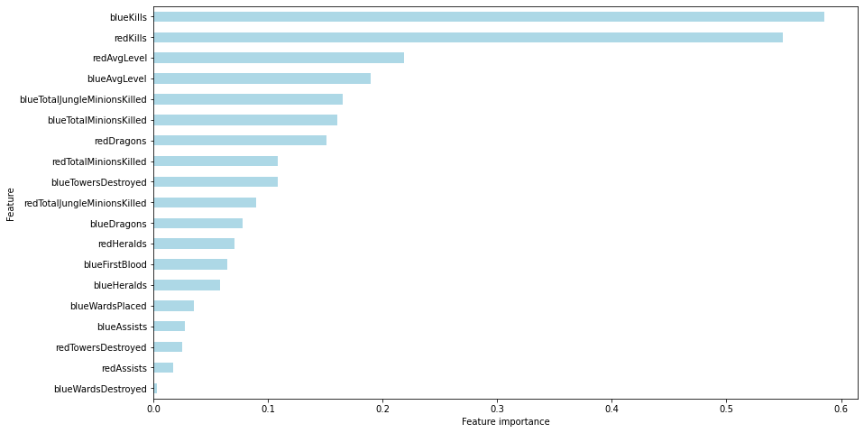

# League of Legends Predictive Model
# Overvie and Buisness Problem
League of Legends is one of the most played and viewed games in the world. It has around 115 million monthly active players and also has a large presence in e-sports. 
This model was created using a dataset with information from the first 10 minutes of League of Legends games. 
The goal of the model is to be able to accurately  predict the outcome of a game before it ends.
League of Legends is a popular game in  e-sports, so knowing the outcome of a game before it is over offers a chance for coaches to train their team to have a better chance of winning.
This tool also gives coaches insight into what factors are most impactful in the game.
# Data

The data set was already fairly clean, however, there were several features that could not be accessed or calculated by players or coaches at the 10 minute mark of a League game. This severely hurt the models performance as those unaccessible features were the most predictive.
# Methods 
We used these models to try and produce the best possible model. 
1. Logistic Regression
2. Decision Trees
3. Bagged Trees
4. Random Forest Classifier    
5. Gradient Boosting Classifier
6. Ada Boosting Classifier
7. XGBoost
8. K Nearest Neighbors




The knn base line model gave a 69% accuracy score on the test data.



After removing innaccessible features, we were left with the following features.



The final model was a adaboost classifier that gave a 72.71% accuracy score on the test data.


# Conclusion and Next steps 

Gold difference is by far the most important variable for our model. The fact that Experience difference is the second most important, probably means that farming is one of the most efficient ways to earn gold(also, it gives you more experience at a lower risk). This most likely means one should be paying more attention to farming and lane phase than getting kills. However since a coach does not have access to this information during the game they are not valuable to our model but they are very valuable to the players. Our most influential features are red kills and blue kills meaning that sometime taking the risk of going for that kill might just be worth it in the end. Blue avg level and Red avg level are also both highly important features in our model and the only way to increase your teams average level is by getting those kills and minion kills. So this all means that how you play the first 10 minutes of a match most of the time can be the difference between winning and loosing. For next steps we would like to do some api calls so that way we are able to have more rows and a lot more columns to hopfully improve upon our model. We would like to know things such as the items bought by each player as well as the champion they selected because both of those features can play a big role in determining the outcome of the game. 
```
project-folder
    |
    League of Legends.pdf
    high_diamond_ranked_10min.csv
    README.md
    images-folder
    notebooks-folder
          |
          report.ipynb
          exploratory-folder
                  |
                  member-1-notebooks-folder
                  member-2-notebooks-folder 
                  member-3-notebooks-folder 
```
